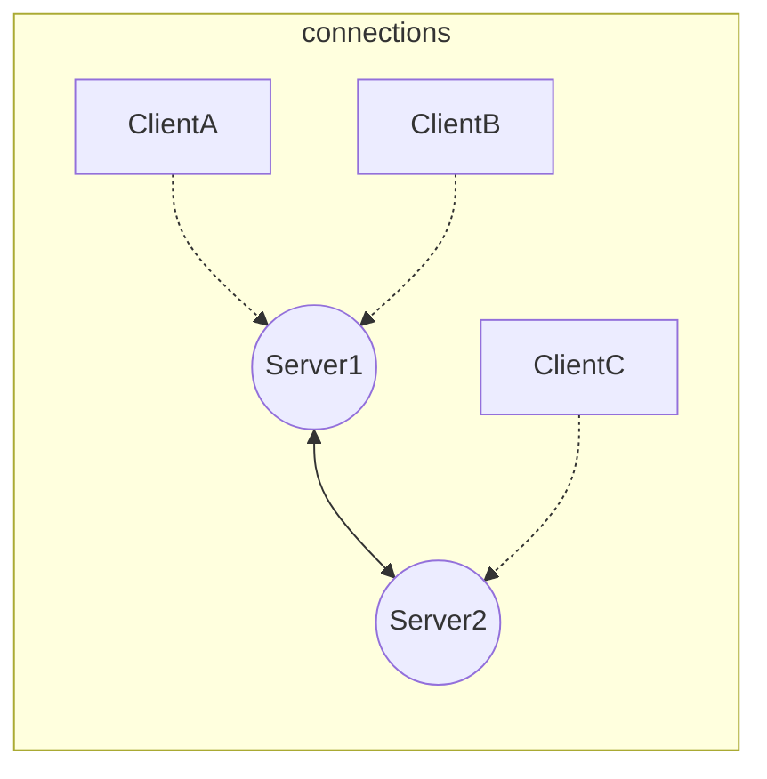
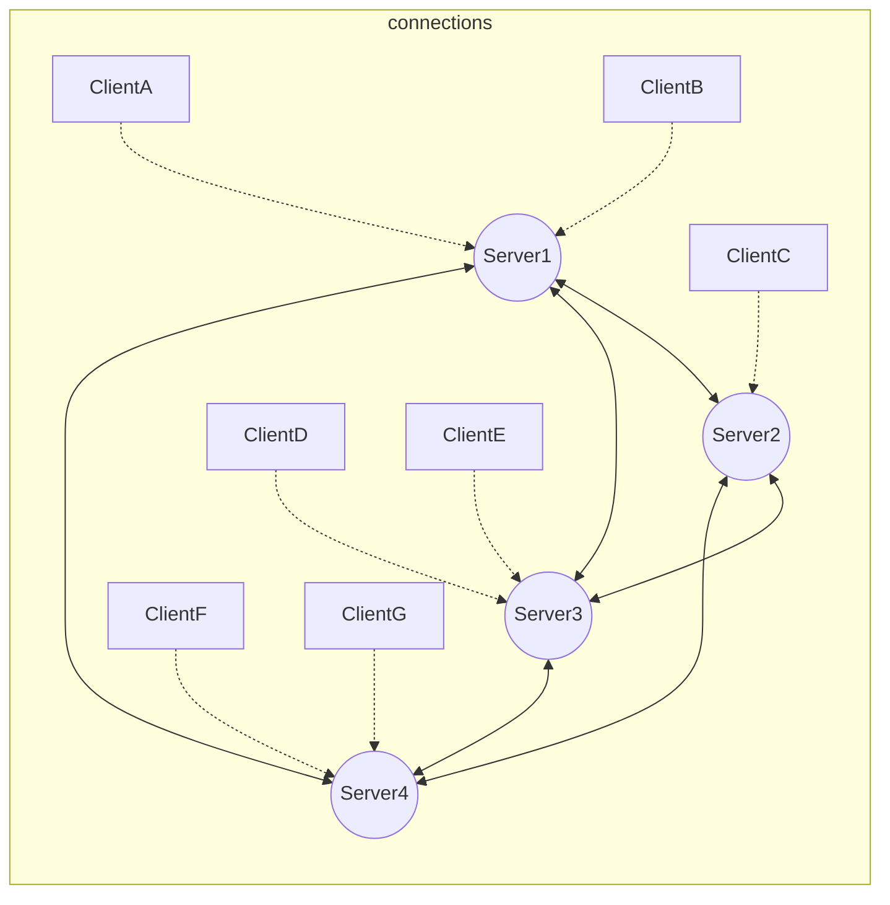
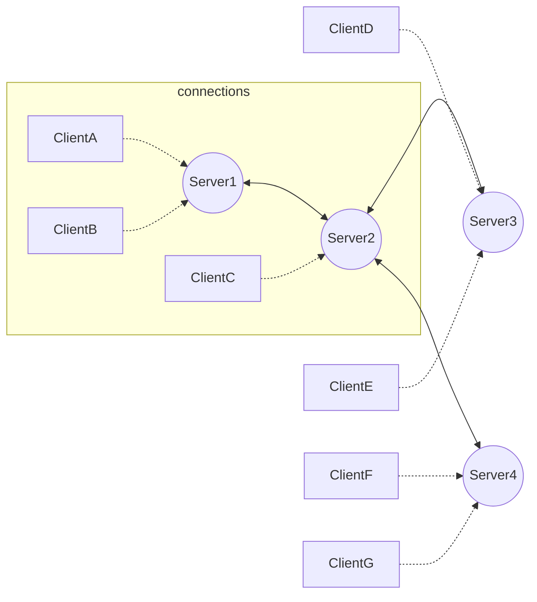
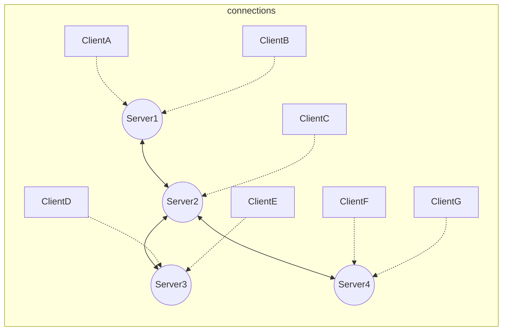
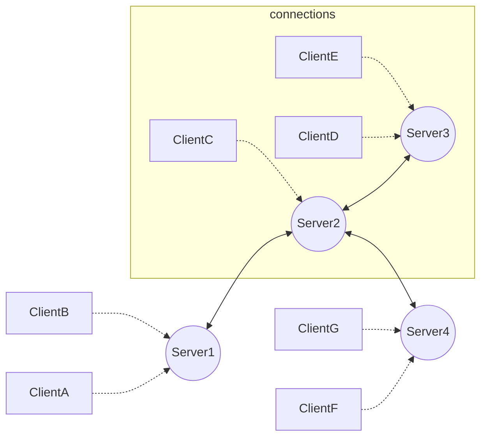

This is an example of a simple neighboorhood, you are able to communicate with everyone in the graph, in becuase you are all directly connected.

This is an example of a more complex neighboorhood. Again all clients can talk to other clients beucase they either share the same homeServer or are connected to servers directly connected to your homeServer.

The following three diagrams explain who you would be able to talk to in a situation, where servers connected and didn't properly form a neighbourhood.

If you are ClientA you can message any Client within the yellow rectangle. ClientA can message ClientB becuase they are on the same server and can message ClientC, becuase their home servers have a direct connection. 

If you are ClientC, you can message anyone within the yellow rectangle. This is becuase the clientC's homeServer, Server2, is directly connected to all the other servers in this neighbourhood. 

If you are ClientE you can message any client within the yellow rectangle. ClientE can message ClientD becuase they are on same the server and can message ClientC, becuase their home servers have a direct connection.

